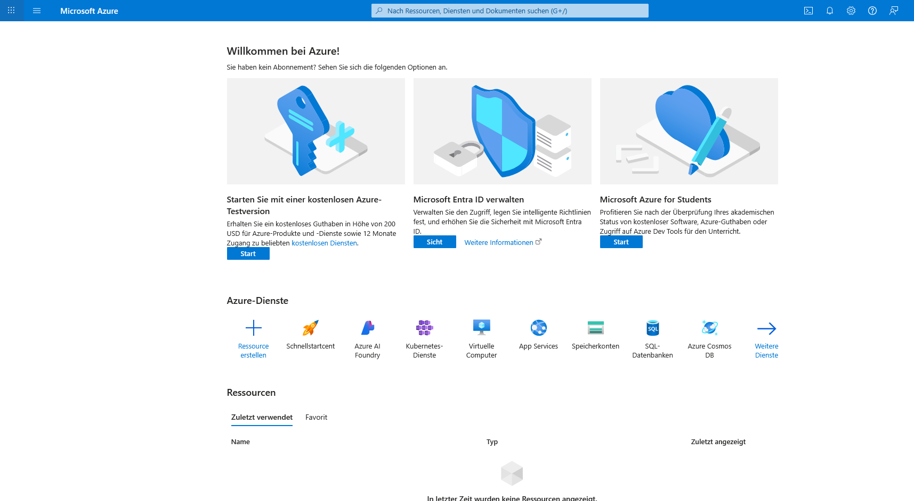
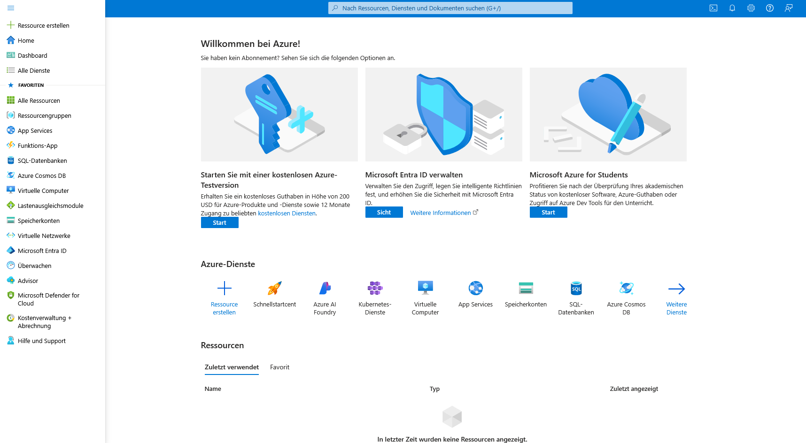
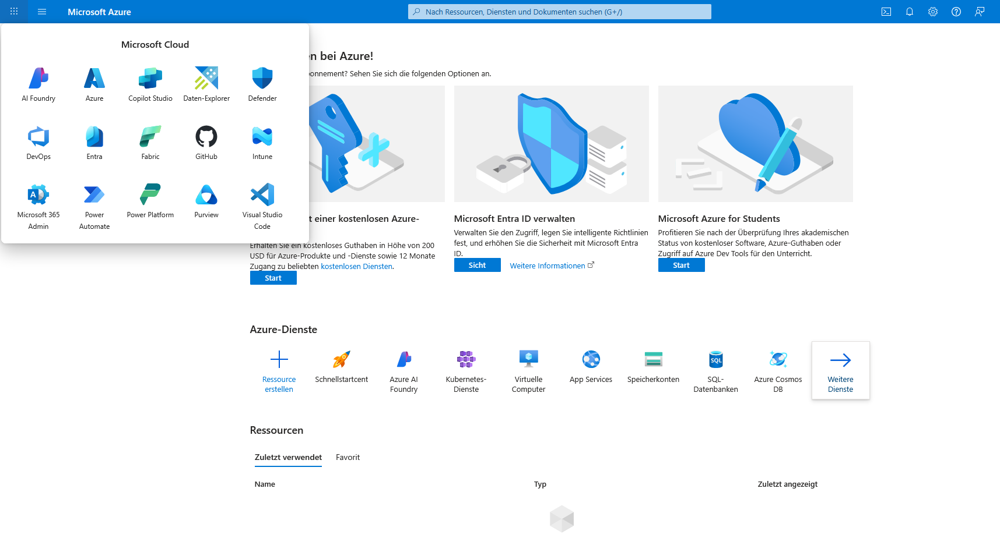
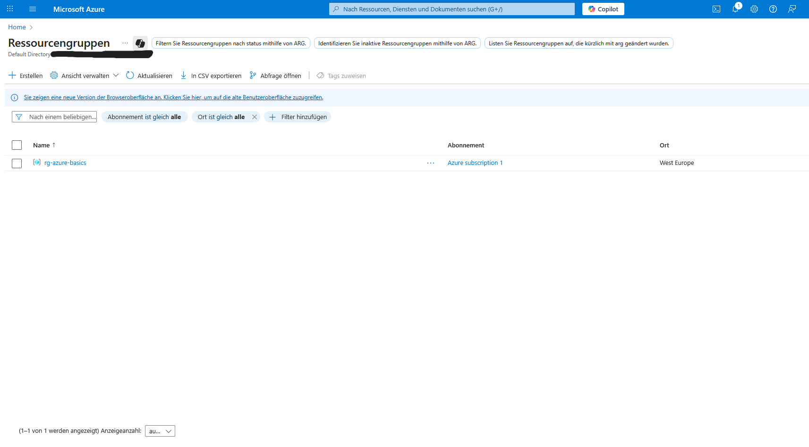
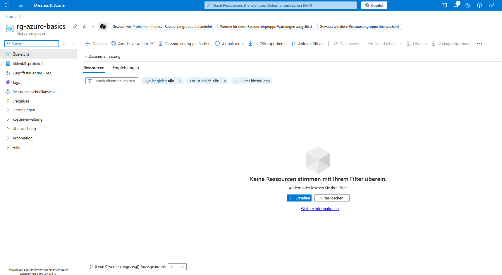
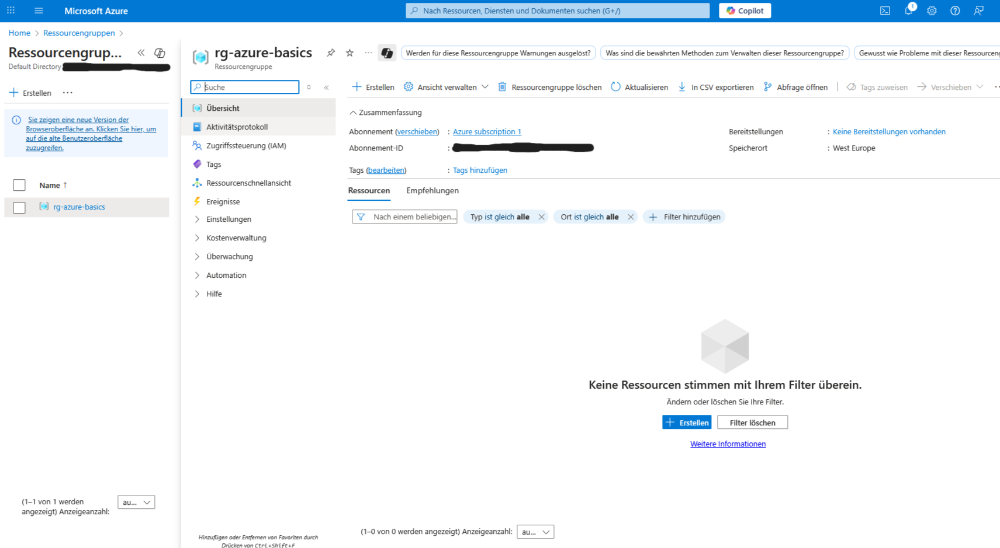
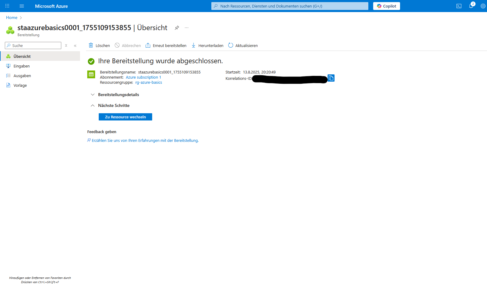
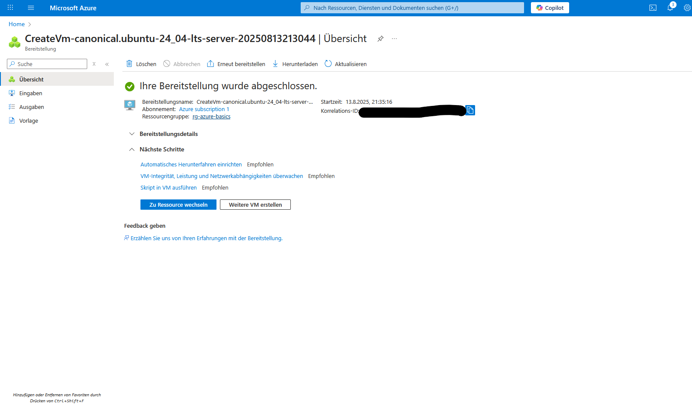
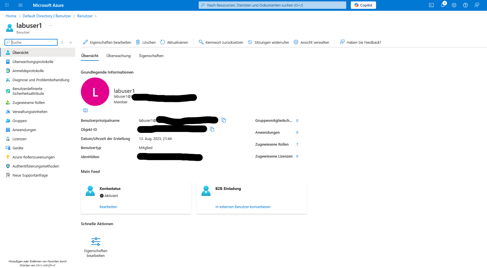
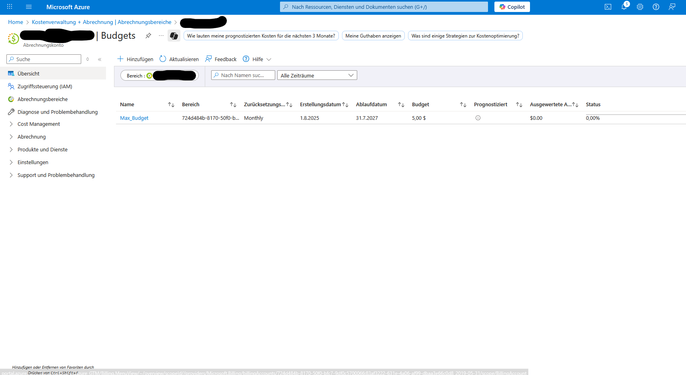

# Lab Report – Azure Basics

## 1. Ziel

In diesem Lab wurden grundlegende Azure-Ressourcen erstellt, verwaltet und anschließend wieder entfernt. Der Schwerpunkt lag auf einem typischen Einstieg in Cloud-Administration: Ressourcen strukturieren, Zugriffe steuern, eine virtuelle Maschine bereitstellen und Kosten im Blick behalten.

## 2. Voraussetzungen

- Azure-Konto
- Zugriff auf das Azure Portal
- grundlegendes Verständnis von Benutzerkonten, Rollen und virtuellen Maschinen

## 3. Durchführung

### 3.1 Orientierung im Azure Portal

Nach dem Login wurden die wichtigsten Bereiche des Portals identifiziert:

- globale Suche
- Ressourcenübersicht
- Hauptnavigation
- Cloud-Dienste

### 3.2 Resource Group

Für das Lab wurde eine eigene Resource Group angelegt.

- **Name:** `rg-azure-basics`
- **Region:** West Europe

Die Resource Group dient als logischer Container für zusammengehörige Ressourcen und vereinfacht Verwaltung, Lifecycle und Kostenübersicht.

### 3.3 Storage Account

Anschließend wurde ein Storage Account erstellt.

- **Name:** `staazurebasics0001`
- **Leistung:** Standard
- **Redundanz:** LRS

Damit wurde die grundlegende Bereitstellung eines Azure-Speicherdienstes nachvollzogen.

### 3.4 Virtuelle Maschine

Für den Compute-Teil des Labs wurde eine kleine Linux-VM bereitgestellt.

- **Betriebssystem:** Ubuntu 22.04 LTS
- **Größe:** B1s
- **Authentifizierung:** SSH

Ziel war nicht der dauerhafte Betrieb eines Servers, sondern das Verständnis des VM-Deployments und der zugehörigen Konfigurationsschritte.

### 3.5 Benutzer und Rollen

Für die Berechtigungsverwaltung wurde ein Benutzer mit eingeschränkten Rechten angelegt.

- **Benutzer:** `labuser1`
- **Rolle:** Reader

Damit wurde das Prinzip nachvollzogen, Rechte möglichst restriktiv und rollenbasiert zu vergeben.

### 3.6 Kostenkontrolle

Zur Kostenüberwachung wurde ein monatliches Budget eingerichtet.

- **Budget:** 5 USD
- **Intervall:** monatlich

Ein Budget dient der Überwachung und Benachrichtigung. Es ist kein hartes technisches Ausgabenlimit.

## 4. Cleanup

Nach Abschluss des Labs wurden die temporären Ressourcen wieder entfernt.

Dazu gehörten insbesondere:

- virtuelle Maschine
- Storage Account
- Resource Group

Damit wurde sichergestellt, dass aus der Übungsumgebung keine unnötigen laufenden Kosten entstehen.

## 5. Ergebnis

Im Lab wurden folgende Themen praktisch angewendet:

- Navigation im Azure Portal
- Resource Groups
- Storage Accounts
- virtuelle Linux-Maschinen
- SSH-basierte Authentifizierung
- Benutzer- und Rollenverwaltung
- Azure RBAC
- Cost Management
- kontrollierter Cleanup

## 6. Lessons Learned

- Eine saubere Resource-Group-Struktur erleichtert Administration und Cleanup.
- Least Privilege ist auch in kleinen Labs sinnvoll und gut demonstrierbar.
- Regionen und Ressourcengrößen sollten bewusst gewählt werden.
- Kostenkontrolle gehört auch bei Testumgebungen zur Administration.
- Cloud-Labs sollten einen definierten Cleanup-Schritt enthalten.
