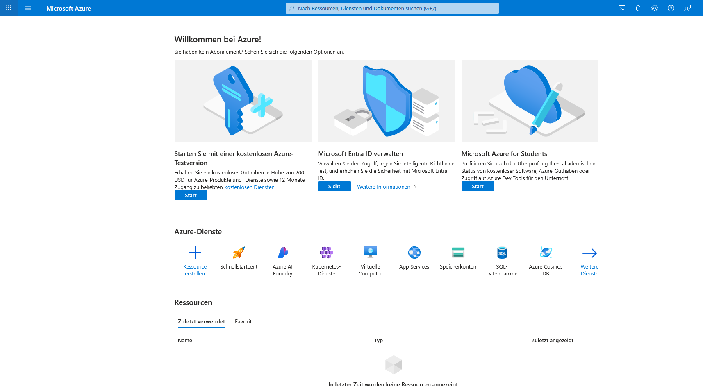
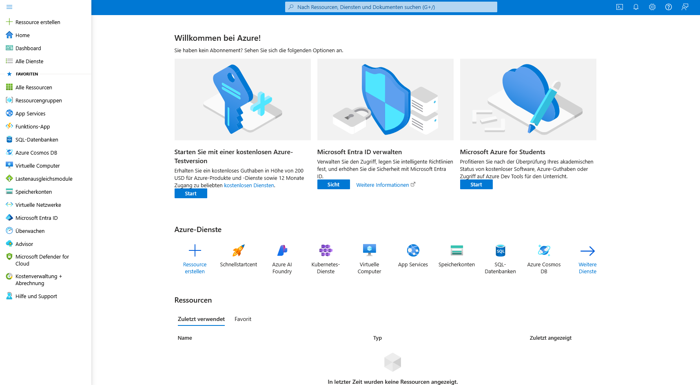
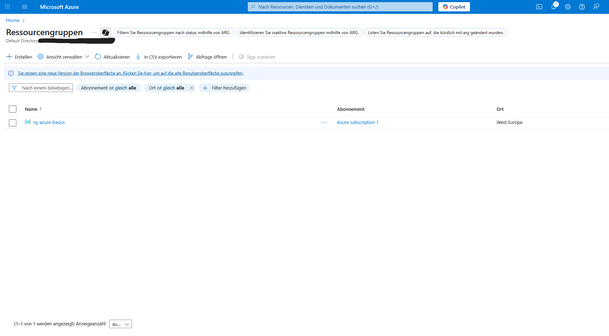
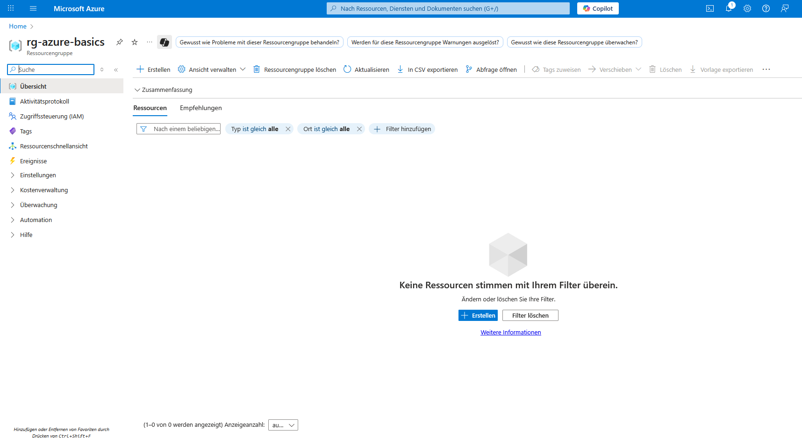
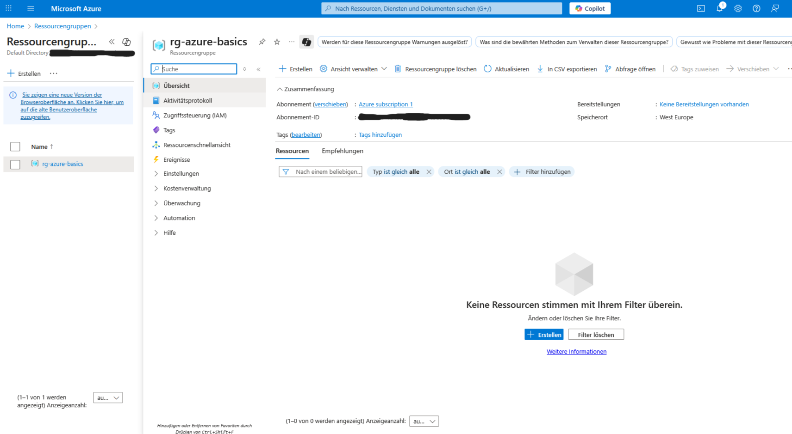
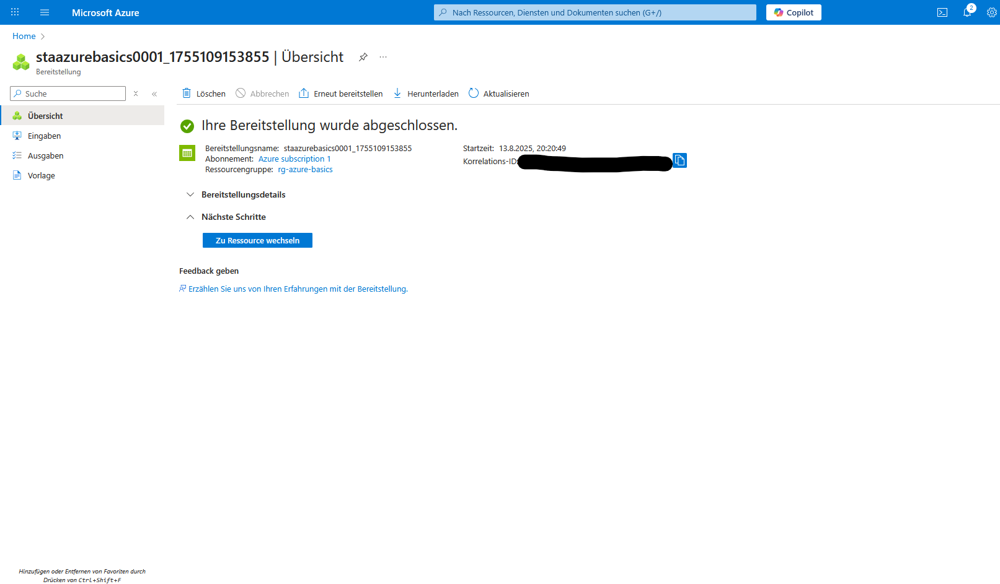
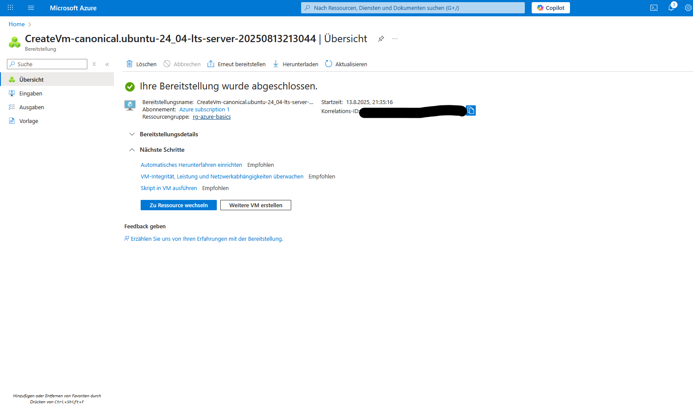
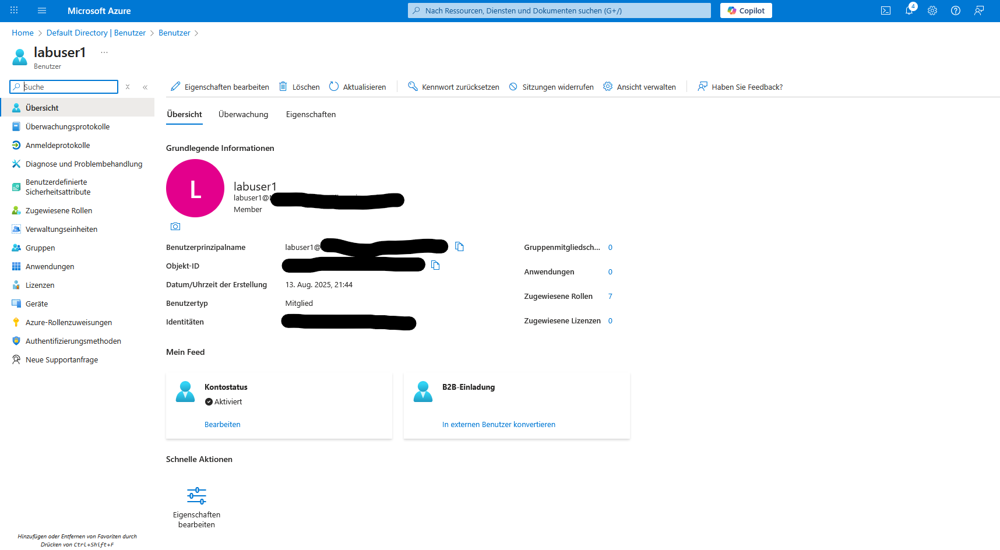
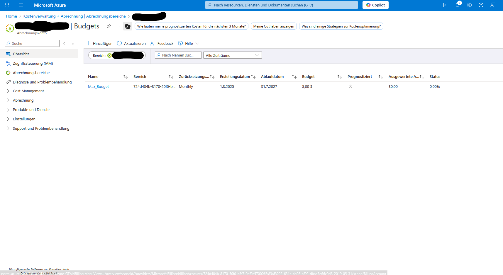

# Lab Report - Azure Basics

## 1. Ziel
Ziel ist es, grundlegende Azure-Ressourcen zu erstellen, Benutzer zu verwalten und die Kostenkontrolle zu testen.

## 2. Voraussetzungen
- Azure-Konto
- GitHub-Repository für Dokumentation

## 3. Durchführung

### Schritt 1 ─ Login & Orientierung
- Portal geöffnet: https://portal.azure.com
- Dashboard, Suchleiste, Ressourcenübersicht identifiziert

---

### Schritt 2 ─ Resource Group
- Name: rg-azure-basics
- Region: West Europe

---

### Schritt 3 – Storage Account
- Name: staazurebasics0001
- Standard Performance, LRS

---

### Schritt 4 – VM-Erstellung
- Ubuntu 22.04 LTS, B1s,
-Authentifizierung: SSH

---

### Schritt 5 – Benutzerverwaltung
- Benutzer: `labuser1` 
- Rolle: Reader

---

### Schritt 6 – Kostenkontrolle
- Budget: 5 USD (in Azure-Portal als Dollar angezeigt)
- Abrechung monatlich

---

## 4. Aufräumen
- Alle Ressourcen (VM, Storage Account, Resource Group) wurden gelöscht

## 5. Fazit
Dieses Lab bietet einen ersten praktischen Eindruck in die Verwaltung von Azure-Diensten.
Ich habe gelernt:
- Die grundlegende Navigation im Azure-Portal
- Das Erstellen und Verwalten von Resource Groups, Storage Accounts und Vms
- Das Anlegen von Benutzern und Zuweisen von Rollen
- Das Einrichten einer Kostenkontrolle

**Dauer:** ca. 1,5 Stunden
**Schwierigkeit:** Einsteigerfreundlich, aber erfordert Aufmerksamkeit bei der Konfiguration