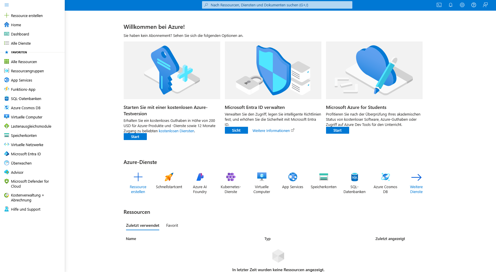
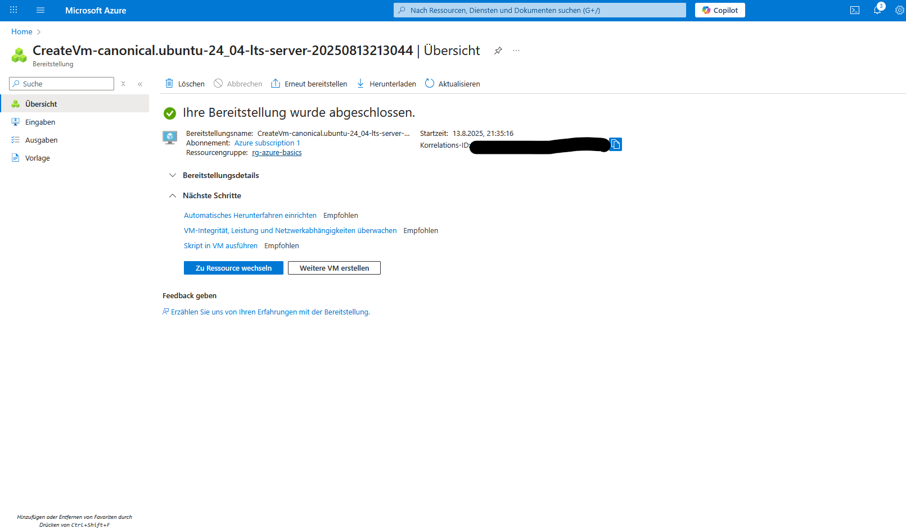

# Lab Report - Azure Basics

## 1. Ziel
Ziel ist es, grundlegende Azure-Ressourcen zu erstellen, Benutzer zu verwalten und die Kostenkontrolle zu testen.

## 2. Voraussetzungen
- Azure-Konto
-GitHub-Repo für Dokumentation

## 3. Durchführung

### Schritt 1 - Login & Orientierung
- Portal geöffnet: https://portal.azure.com
- Dashboard, Suchleiste, Ressourcenübersicht identifiziert
- 
- 
- 

### Schritt 2 - Resource Group
- Name: rg-azure-basics
- Region: West Europe
- 
- 
- 

### Schritt 3 - Storage Account
- Name: staazurebasics0001
- Standard Performance, LRS
- 

### Schritt 4 - VM-Erstellung
- Ubuntu 22.04 LTS, B1s, SSH-Auth
- 

### Schritt 5 - Benutzerverwaltung
- Benutzer: labuser1, Rolle: Reader
- 

### Schritt 6 - Kostenkontrolle
- Budget 5€
- 

## 4. Aufräumen
- Ressourcen gelöscht

## 5. Fazit
Dieses Lab bietet einen ersten praktischen Eindruck in Azure-Dienste und deren Verwaltung.