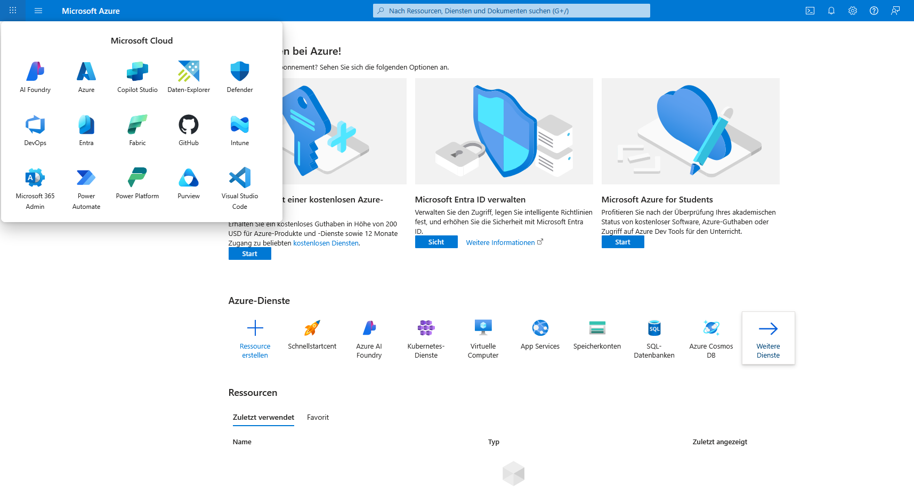

# Lab Report – Azure Basics

## 1. Ziel
Ziel dieses Labs ist es, grundlegende Azure-Ressourcen zu erstellen, Benutzer zu verwalten und die Kostenkontrolle zu testen.

---

## 2. Voraussetzungen
- Azure-Konto  
- GitHub-Repository für die Dokumentation  

---

## 3. Durchführung

### Schritt 1 – Login & Orientierung
**Ziel:** Zugang zum Azure-Portal und erste Orientierung in der Benutzeroberfläche.

1. Aufruf des Portals: [https://portal.azure.com](https://portal.azure.com)  
2. Identifikation der wichtigsten Bereiche: Dashboard, Suchleiste, Ressourcenübersicht.

  

  

  

---

### Schritt 2 – Resource Group
**Ziel:** Anlegen einer logischen Gruppierung für Ressourcen, um Verwaltung und Kostenkontrolle zu erleichtern.

- Name: `rg-azure-basics`  
- Region: West Europe

  

  

  

---

### Schritt 3 – Storage Account
**Ziel:** Erstellung eines Speicherkontos zur Ablage von Daten.

- Name: `staazurebasics0001`  
- Leistung: Standard  
- Redundanz: LRS

  

---

### Schritt 4 – VM-Erstellung
**Ziel:** Bereitstellung einer virtuellen Maschine für Test- und Lernzwecke.

- OS: Ubuntu 22.04 LTS  
- Größe: B1s  
- Authentifizierung: SSH

  

---

### Schritt 5 – Benutzerverwaltung
**Ziel:** Anlegen eines Benutzers mit minimalen Rechten.

- Benutzername: `labuser1`  
- Rolle: Reader

  

---

### Schritt 6 – Kostenkontrolle
**Ziel:** Festlegung eines Budgets zur Überwachung der Ausgaben.

- Budget: 5 USD (Azure zeigt Beträge in US-Dollar an)  
- Abrechnung: monatlich

  

---

## 4. Aufräumen
- Alle erstellten Ressourcen (VM, Storage Account, Resource Group) wurden gelöscht, um Kosten zu vermeiden.

---

## 5. Fazit
Dieses Lab bot einen ersten praktischen Einblick in die Verwaltung von Azure-Diensten.  
Ich habe gelernt:
- Navigation und Bedienung im Azure-Portal  
- Erstellen und Verwalten von Resource Groups, Storage Accounts und VMs  
- Anlegen von Benutzern und Zuweisung von Rollen  
- Einrichten einer Kostenkontrolle  

**Persönliche Erkenntnisse:**  
- Die Menüstruktur von Azure ist umfangreich, aber logisch aufgebaut, wenn man die Suchfunktion nutzt.  
- Das Kostenlimit ist schnell gesetzt, allerdings sollte man die Standardregion bewusst wählen, um unnötige Kosten zu vermeiden.  

**Dauer:** ca. X Stunden  
**Schwierigkeit:** Einsteigerfreundlich, erfordert aber sorgfältiges Arbeiten bei der Konfiguration.  
